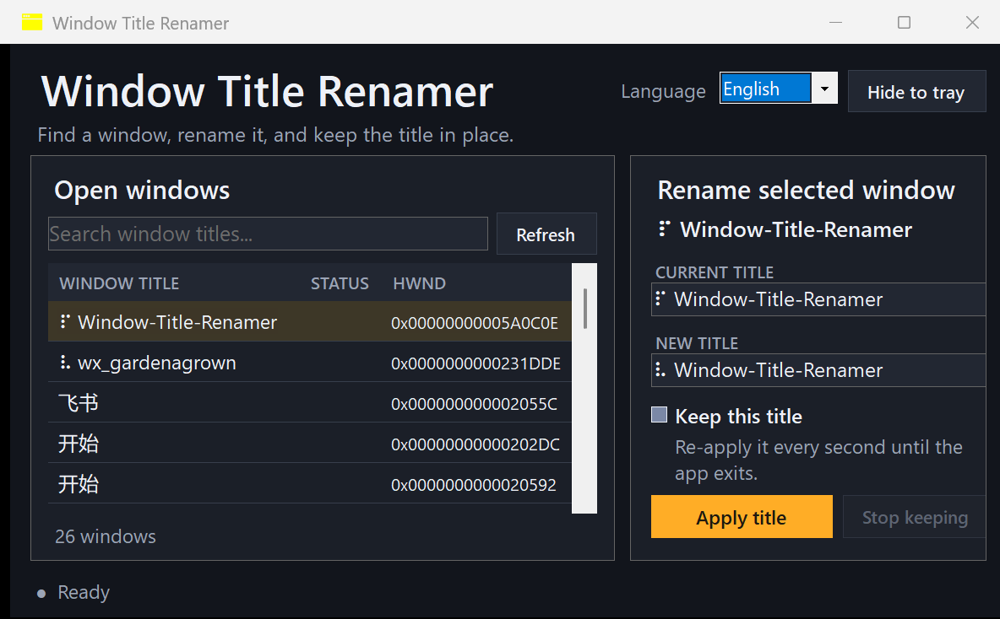

<p align="center">
  
  <br />
  <a href="README.md">English</a> | <strong>简体中文</strong>
</p>

# 窗口标题重命名工具

通过轻量图形界面修改任意可见 Windows 桌面窗口的标题，包括任务栏按钮标签，当其他程序尝试恢复原标题时，本程序还可以持续重新应用指定标题。

**仅支持 Windows x64。** 发布版本为自包含的单文件程序，无需另行安装 .NET。

## 功能

- 在现代化单页界面中搜索和刷新已打开的窗口
- 在后台加载和刷新窗口列表，避免阻塞界面操作
- 立即修改所选窗口的标题
- 每秒重新应用一次标题，防止标题被其他程序还原
- 隐藏到系统托盘后继续维持规则
- 运行时切换英文和简体中文
- 目标窗口关闭后自动移除对应规则

持续保持规则仅在本次程序运行期间有效，彻底退出后会被清空。

## 用法

1. 从**发布页面**下载可执行文件并运行。
2. 搜索窗口标题，或从自动刷新的窗口列表中选择目标窗口，主窗口可见时，列表每两秒刷新一次。
3. 输入新标题，按需启用**持续保持此标题**，然后点击**应用标题**，也可以按 <kbd>Enter</kbd> 应用。
4. 点击**停止保持**可移除活动规则。
5. 最小化或关闭主窗口会将程序隐藏到系统托盘，双击托盘图标可恢复窗口，也可通过托盘菜单彻底退出。

对于以管理员权限运行或拒绝 `SetWindowText` 的窗口，可能需要以相同权限运行本工具，也可能无法完成重命名。

## 构建

```powershell
dotnet build
dotnet publish -c Release -r win-x64
```

每次发布都会在 `bin/Release-Archives/` 下生成带时间戳的自包含 ZIP 归档包。

<p align="center">
  
</p>
